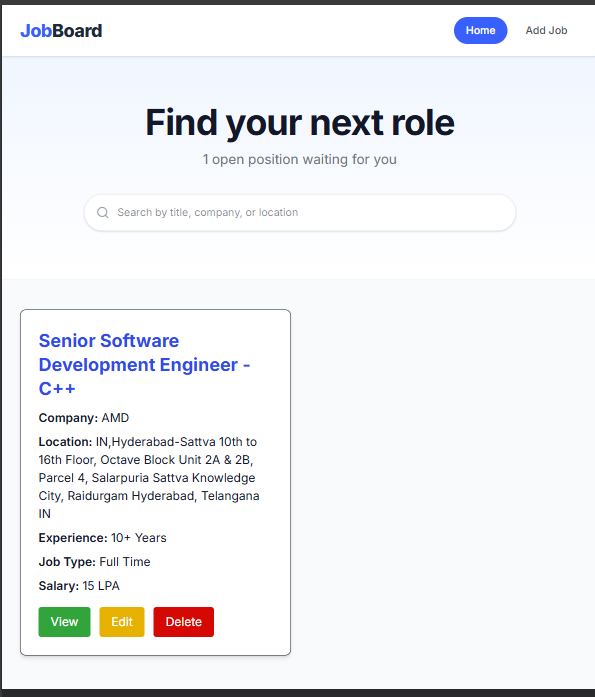
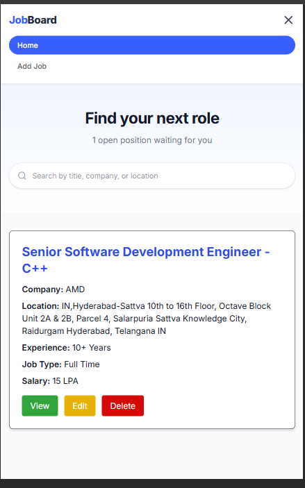
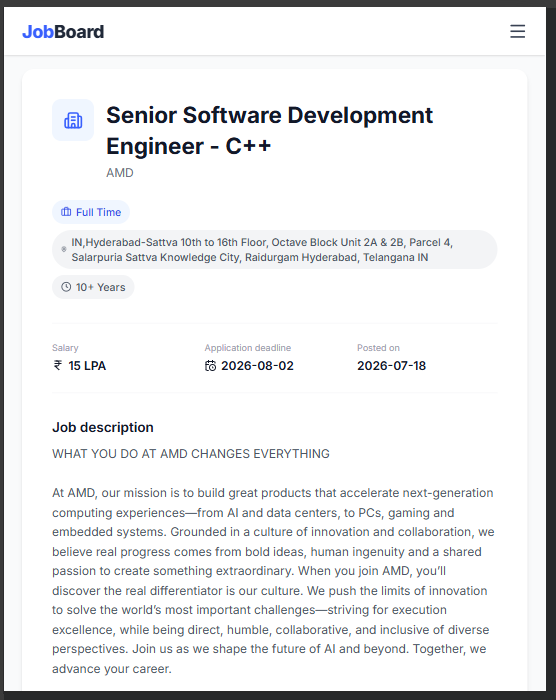
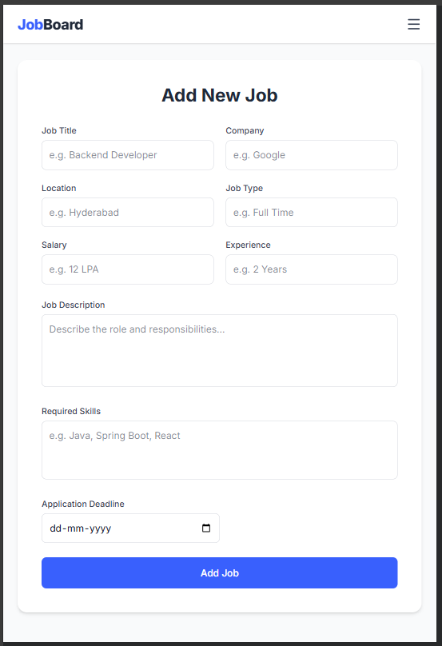
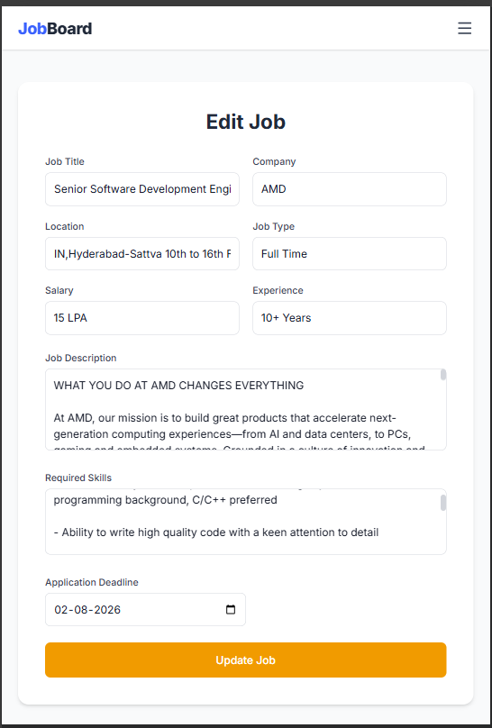

# Job Board Application

A full-stack job board web application that allows employers to post job openings and manage them through a clean, responsive interface, built with a Spring Boot REST API backend and a React frontend.

---

## Table of contents

- [Project overview](#project-overview)
- [Features](#features)
- [Tech stack](#tech-stack)
- [Project architecture](#project-architecture)
- [Folder structure](#folder-structure)
- [API endpoints](#api-endpoints)
- [Installation guide](#installation-guide)
- [Screenshots](#screenshots)
- [Future enhancements](#future-enhancements)
- [Author](#author)

---

## Project overview

The Job Board Application provides complete CRUD (Create, Read, Update, Delete) functionality for managing job postings. The backend exposes a RESTful API built with Spring Boot, Spring Data JPA, and MySQL. The frontend is a single-page application built with React, React Router, and Tailwind CSS, communicating with the backend via Axios.

For a detailed breakdown of how requests flow through the system, see [ARCHITECTURE.md](./ARCHITECTURE.md). For full request/response examples of every endpoint, see [API.md](./API.md).

---

## Features

- View all job openings in a responsive card grid
- Search jobs by title, company, or location
- View full details of a single job
- Add a new job posting
- Edit an existing job posting
- Delete a job posting
- Client-side routing with dedicated pages per action
- Responsive design with a mobile-friendly navigation menu
- MySQL persistence via Spring Data JPA

---

## Tech stack

**Frontend**
- React (with Vite)
- React Router DOM
- Tailwind CSS
- Axios
- lucide-react (icons)

**Backend**
- Spring Boot
- Spring Data JPA / Hibernate
- MySQL
- Maven
- Lombok
- Jakarta Bean Validation

---

## Project architecture

```
React (Vite)
    |
    | Axios (HTTP / JSON)
    v
Spring Boot REST Controller
    |
    v
Service Layer (business logic)
    |
    v
Repository Layer (Spring Data JPA)
    |
    v
MySQL Database
```

See [ARCHITECTURE.md](./ARCHITECTURE.md) for the full layer-by-layer explanation.

---

## Folder structure

```
JobBoard/
├── backend/
│   └── src/main/java/com/jobboard/
│       ├── config/
│       ├── controller/
│       ├── dto/
│       │   ├── request/
│       │   └── response/
│       ├── entity/
│       ├── exception/
│       ├── repository/
│       ├── service/
│       │   └── impl/
│       ├── mapper/
│       ├── util/
│       └── BackendApplication.java
│
├── frontend/
│   └── src/
│       ├── assets/
│       ├── components/
│       │   ├── Navbar.jsx
│       │   └── JobCard.jsx
│       ├── pages/
│       │   ├── Home.jsx
│       │   ├── AddJob.jsx
│       │   ├── EditJob.jsx
│       │   ├── JobDetails.jsx
│       │   └── NotFound.jsx
│       ├── services/
│       │   └── jobService.js
│       ├── App.jsx
│       └── main.jsx
│
├── README.md
├── ARCHITECTURE.md
├── API.md
└── screenshots/
```

---

## API endpoints

| Method | Endpoint | Description |
|---|---|---|
| GET | `/api/jobs` | Get all jobs |
| GET | `/api/jobs/{id}` | Get a job by ID |
| POST | `/api/jobs` | Create a new job |
| PUT | `/api/jobs/{id}` | Update an existing job |
| DELETE | `/api/jobs/{id}` | Delete a job |

Full request/response payloads and status codes are documented in [API.md](./API.md).

---

## Installation guide

### Prerequisites
- Java 17+ and Maven
- Node.js and npm
- MySQL running locally

### Backend setup

```bash
git clone <backend-repository-url>
cd backend
```

Create a MySQL database:
```sql
CREATE DATABASE jobboard;
```

Update `src/main/resources/application.properties` with your MySQL credentials, then run:
```bash
mvn spring-boot:run
```

The backend starts on `http://localhost:8080`.

### Frontend setup

```bash
git clone <frontend-repository-url>
cd frontend
npm install
npm run dev
```

The frontend starts on `http://localhost:5173`.

---

## Screenshots

### Home page


### Mobile navigation menu


### Job details page


### Add job form


### Edit job form


---

## Future enhancements

- User authentication and role-based authorization (job seeker vs. recruiter)
- Job application flow (apply with resume upload)
- Server-side search and filtering
- Email notifications on new applications
- CI/CD pipeline and cloud deployment

---

## Author

**Adla Ramakrishna Reddy**